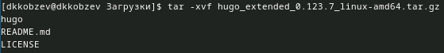
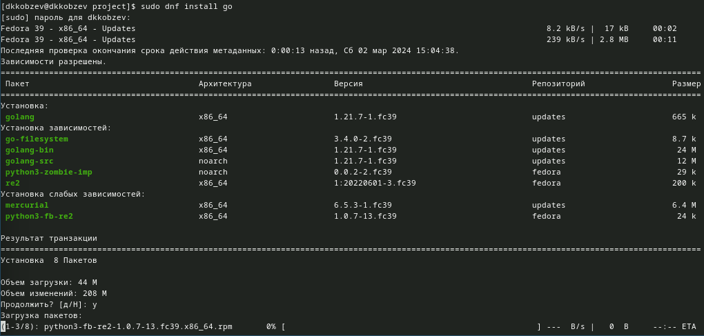

---
## Front matter
lang: ru-RU
title: Лабораторная работа №1
subtitle: Архитектура компьютера и операционные системы
author:
  - Кобзев Д. К.
institute:
  - Российский университет дружбы народов, Москва, Россия
date: 30 августа 2005

## i18n babel
babel-lang: russian
babel-otherlangs: english

## Formatting pdf
toc: false
toc-title: Содержание
slide_level: 2
aspectratio: 169
section-titles: true
theme: metropolis
header-includes:
 - \metroset{progressbar=frametitle,sectionpage=progressbar,numbering=fraction}
 - '\makeatletter'
 - '\beamer@ignorenonframefalse'
 - '\makeatother'

## Fonts
mainfont: PT Serif
romanfont: PT Serif
sansfont: PT Sans
monofont: PT Mono
mainfontoptions: Ligatures=TeX
romanfontoptions: Ligatures=TeX
sansfontoptions: Ligatures=TeX,Scale=MatchLowercase
monofontoptions: Scale=MatchLowercase,Scale=0.9
---

# Информация

## Докладчик

:::::::::::::: {.columns align=center}
::: {.column width="70%"}

  * Кобзев Дмитрий Константинович
  * студент
  * прикладная информатика
  * Российский университет дружбы народов
  * [1132231936@rudn.ru](mailto:1132231936@rudn.ru)

:::
::: {.column width="30%"}

:::
::::::::::::::

# Реализация проекта

# Установка необходимого программного обеспечения

Распаковываем файлы hugo

Перемещаем hugo в /usr/local/bin

## Установка необходимого программного обеспечения

Устанавливаем hugo

# Скачивание шаблона темы сайта

Переносим шаблон в свой репозитория

## Скачивание шаблона темы сайта

Скачиваем шаблон

# Размещение шаблона на хостинге git и установка параметра для URLs сайта

Создаем репозиторий сайта

Клонируем репозиторий

## Размещение шаблона на хостинге git и установка параметра для URLs сайта

Создаем ветку main

# Размещение заготовки сайта на Github pages 

Используем команду git submodule

## Размещение заготовки сайта на Github pages 

Заготовка сайта размещена на Github pages 

